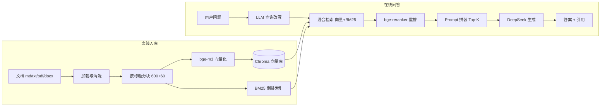

# AI 面试经验助手（RAG 问答系统）

把 AI 岗位面试资料（面经、题库、项目复盘、官方文档）整理成个人知识库，提问时混合检索相关资料，由大模型生成**带引用标注**的回答——答案里的每个观点都能追溯到来源文件。

   

## 项目亮点

- **混合检索 + 重排**：向量召回与 BM25 关键词融合，bge-reranker 精排；模糊问题先由 LLM 改写再检索
- **生语料零预处理**：原始面经、聊天记录、网页复制文本直接扔进去，入库时自动去噪并用 LLM 整理成标准问答格式
- **答案可核验**：仅基于检索片段生成，答案标注引用编号，可点回原文
- **流式对话**：SSE 打字机输出，支持最近 6 轮多轮追问
- **文档自助管理**：网页上传（md / txt / pdf / docx）、列表、删除，按 SHA-256 去重
- **工程化**：缓存降延迟省 token、结构化日志、友好错误提示、12 项自动化测试、30 题评估 30/30
- **低门槛部署**：本地一条命令启动，也支持 Docker / 云服务器

## 技术栈

| 模块 | 选型 |
|------|------|
| Web 框架 | FastAPI + Uvicorn |
| 向量库 | Chroma（本地持久化，数据量大后可迁 pgvector / Milvus） |
| Embedding | bge-m3（硅基流动，免费）或通义 text-embedding-v3 |
| 重排 | bge-reranker-v2-m3（硅基流动，失败自动降级） |
| 生成 | DeepSeek deepseek-chat（OpenAI 兼容接口） |
| 关键词检索 | rank_bm25（中文二元组切分） |
| 测试 | pytest（检索与生成全部打桩，离线可跑） |

## 系统架构



## 快速开始

### 本地运行

1. 安装 Python 3.11+（3.14 已验证）
2. 复制 `.env.example` 为 `.env`，填写两个 key：
   - `DEEPSEEK_API_KEY`：DeepSeek 生成密钥
   - `EMBED_API_KEY`：向量密钥（硅基流动 bge-m3 免费，或通义 DashScope，见 `.env.example` 内注释）
3. 安装依赖：`pip install -r requirements.txt`
4. 放入语料：把面经文档放进 `data/mianjing/`（没有语料可用 `examples/` 示例体验，见 [examples/README.md](examples/README.md)）
5. 入库：`python scripts/ingest_cli.py data/mianjing`
6. 启动：`python -m uvicorn app.main:app --reload`，浏览器打开 `http://127.0.0.1:8000`（本机地址，需在浏览器地址栏手动输入）

Windows 也可直接双击 `start.bat` 一键启动。

完整流程与使用说明见 [docs/使用手册.md](docs/使用手册.md)，语料搜集与添加见 [docs/语料搜集与添加指南.md](docs/语料搜集与添加指南.md)。

### Docker 部署

```bash
docker compose up -d --build
```

浏览器打开 `http://127.0.0.1:8000`。`./data`（含向量库）通过 volume 持久化；容器内重新入库：

```bash
docker compose exec rag-assistant python scripts/ingest_cli.py --reset data/mianjing
```

## 功能列表

- [x] 问答：检索 → 重排 → 生成，答案带引用（已引用 / 未引用标注）
- [x] 混合检索：向量 + BM25 融合，模糊问题 LLM 改写后再检索
- [x] 生语料自动处理：规则清洗 + LLM 结构化（`--no-structure` 可关闭）
- [x] 流式输出：SSE 打字机效果
- [x] 多轮对话：最近 6 轮上下文
- [x] 文档管理：上传 / 列表（含块数）/ 删除，按文件哈希去重
- [x] 缓存：相同问题 1 小时命中，省 token 降延迟
- [x] 日志：问题、耗时、token 用量
- [x] 友好错误提示：key 失效 / 限流 / 超时

## 评估结果（30/30 · 2026-08-19）

30 道覆盖大模型基础 / RAG / Agent / 工程 / 项目深挖 / 流程行为的测试题，逐题检索 top-3 并生成带引用回答，检查三项：是否命中相关来源、回答是否忠于资料、引用编号是否可核验。

| 类别 | 题数 | 结果 |
|------|------|------|
| 大模型基础 | 5 | ✅ 5/5 |
| RAG | 8 | ✅ 8/8 |
| Agent | 5 | ✅ 5/5 |
| 工程与部署 | 5 | ✅ 5/5 |
| 项目深挖 | 4 | ✅ 4/4 |
| 流程与行为 | 3 | ✅ 3/3 |
| **合计** | **30** | **✅ 30/30** |

优化历程：纯向量检索版 24/30 合格 → 加入「按标题分块 + bge-reranker 重排 + 项目复盘语料」后 30/30 命中并带引用。

> 说明：30/30 是基于本地完整语料（`data/` 不随仓库分发）与 DeepSeek / 硅基流动 key 的实测成绩。
> 复现步骤：先按「快速开始」填好 `.env` 并入库（没有自己的语料可用 `examples/` 示例体验），再运行
> `python tests/run_eval.py`，自动生成 `tests/eval_report.md`，明细见 `tests/eval_results.jsonl`。
> 用示例语料可以跑通整个评估流程，但检索命中数会因语料内容和数量而异，不会等于 30/30。

## 测试

```bash
python -m pytest tests -q   # 12 项，检索与生成打桩，离线可跑
```

GitHub Actions 每次 push 会自动跑一遍（见仓库根目录 `.github/workflows/tests.yml`）。

## 目录结构

```
rag-assistant/
├── app/
│   ├── main.py              # FastAPI 入口
│   ├── config.py            # 配置（读取 .env）
│   ├── api/
│   │   ├── ask.py           # 问答接口 POST /api/ask
│   │   └── ingest.py        # 上传入库接口 POST /api/documents
│   ├── core/
│   │   ├── loader.py        # 文档加载 + 清洗
│   │   ├── chunker.py       # 分块
│   │   ├── embedder.py      # embedding 封装
│   │   ├── vector_store.py  # Chroma 封装
│   │   ├── retriever.py     # 检索（含混合检索）
│   │   ├── generator.py     # Prompt 组装 + LLM 调用 + 引用校验
│   │   └── ingester.py      # 入库流程编排
│   └── static/index.html    # 问答 + 上传页面
├── scripts/ingest_cli.py    # 命令行批量入库
├── data/                    # 面经文档 + Chroma 数据（不提交 GitHub）
├── tests/eval_questions.jsonl  # 30 道测试问题（评估用）
├── docs/architecture.md     # 架构与设计决策
├── requirements.txt
└── .env.example
```

## 数据合规与许可

- 面经语料仅用于个人学习，`data/` 目录不提交 GitHub；来源与许可清单见 `data/mianjing/00-语料来源与许可.md`
- 本项目代码以 MIT 协议开源，LICENSE 位于仓库根目录
